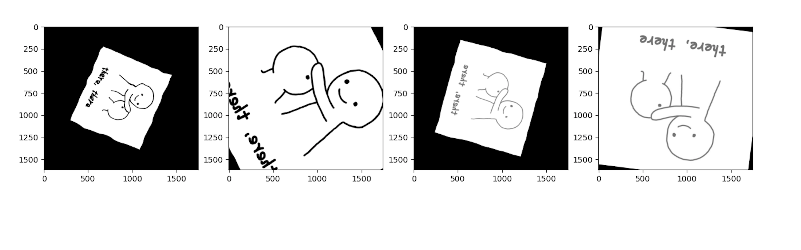
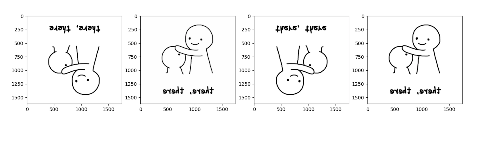
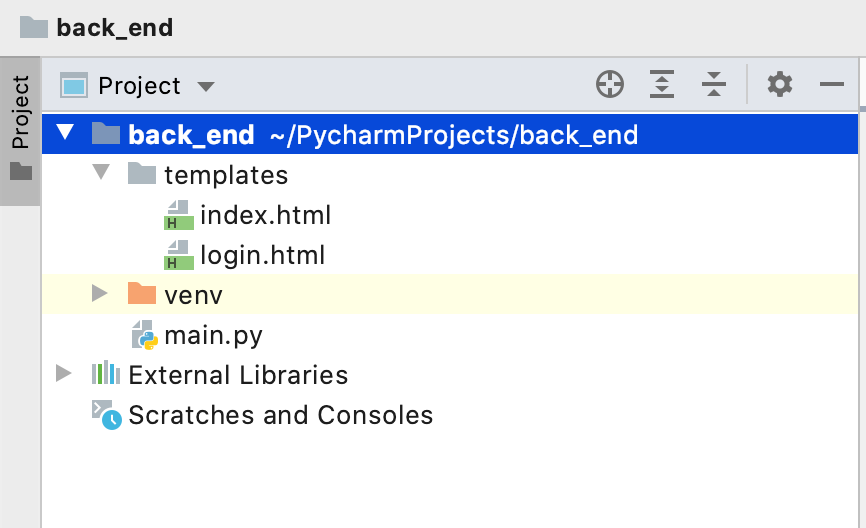
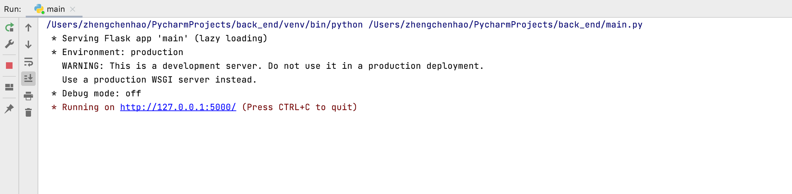
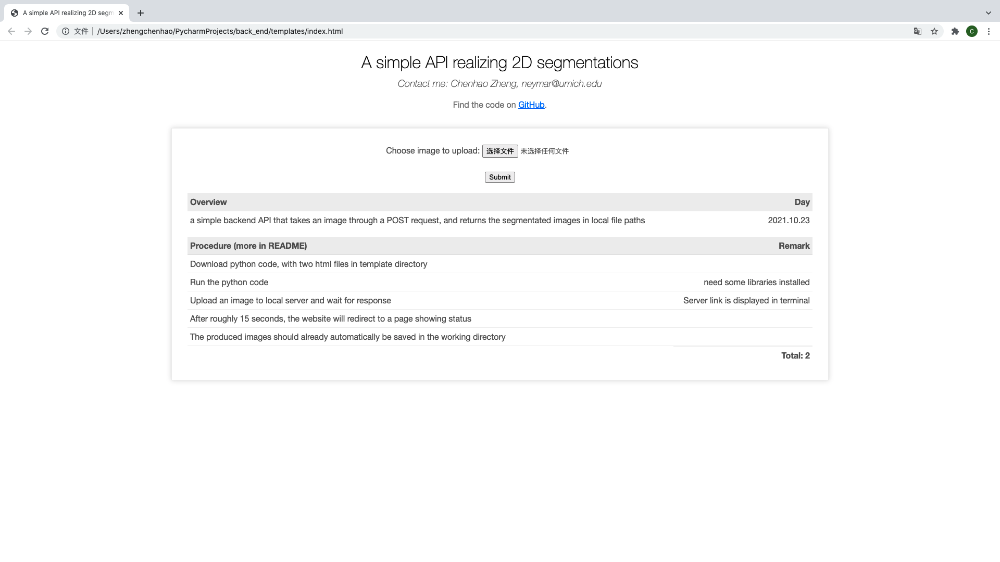
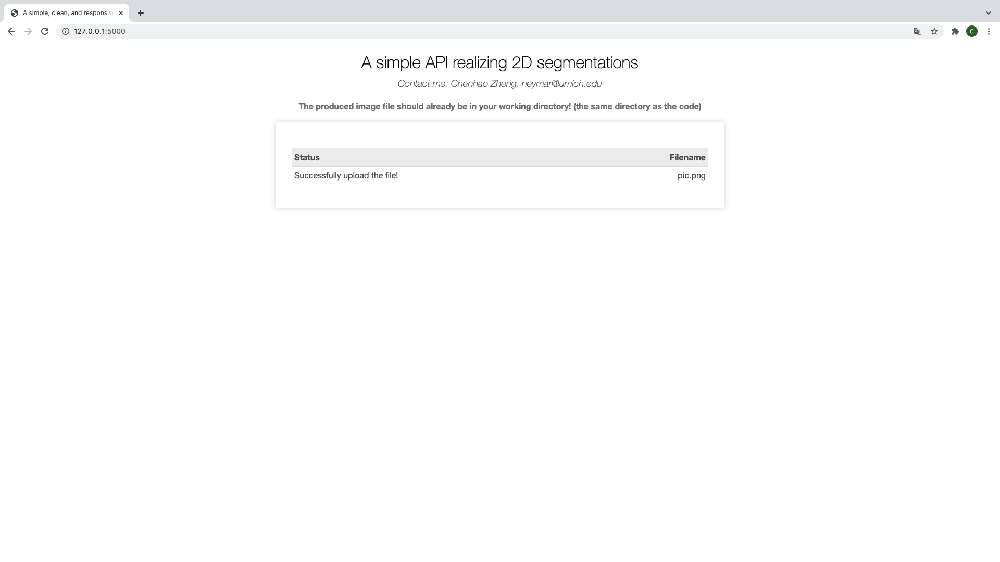
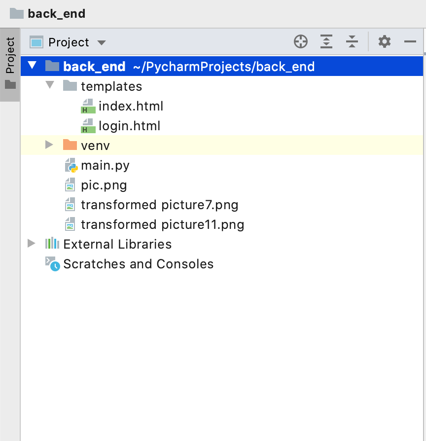

# README

This is a a simple backend API that takes an image through a POST request, and returns the segmentated images in local file paths. 

## Supported Function

This API mainly support **spatial augmentations** , including 

* mirroring, 

* channel translation, 

* elastic deformation, 

* rotations, 

* scaling 

* resampling. 

The main reference of implementation is https://github.com/MIC-DKFZ/batchgenerators. The example of the supported functions of our model as follows:

Suppose the the user's input image (through post request) is: 

This program will output the images as follows: (output as two files to local directory) 

## How to use it

1. Download the code from my Github repository: https://github.com/zhengchenhao-solo/A-simple-API-realizing-2D-segmentations
2. Put the codes into your python project. **Remember to include the template directory in the working directory**! It contains the html files that will be used by flask library.

3. Install all the necessary libraries that will be needed when running the code, including **flask, numpy, matplotlib, opencv-python, batchgenerators.**

4. Run the code. Then you will be able to see the **local server link** in your terminal.

   

5. Click the local server link, you will be directed to the home page of produced website like this: 

   

6. Choose the image that you want to process, and click submit.

7. **Wait for 10-20 seconds for the server to process**. When the process is finished, you will be **redirected to another web page** showing the success status. **At the same time,** you would be able to **see the produced image file** **in your working directory.**

   

